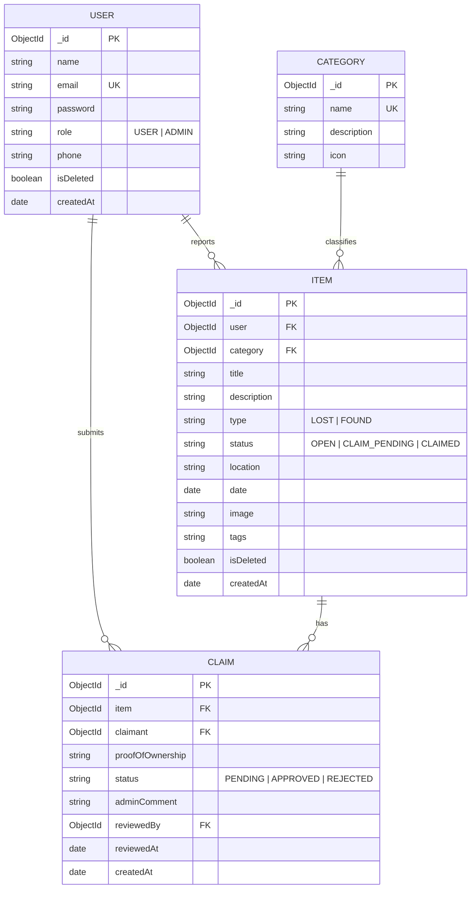

# 🔍 FindIt AI — AI-Based Lost & Found Management System

> A production-grade, full-stack **MERN** application integrated with **Google Gemini 1.5 Flash AI** for semantic item matching, automated claim lifecycle verification, role-based access control (RBAC), admin visual analytics, and enterprise security hardening.

---

## 🚀 Key Features

* **AI Semantic Item Matcher**: Uses Google Gemini 1.5 Flash natural language reasoning to correlate items by synonyms (e.g. *"Samsung mobile"* vs *"Galaxy phone"*), damage attributes, and location proximity, with an automatic **Zero-Crash Heuristic Fallback Engine**.
* **Role-Based Access Control (RBAC)**: Secure JWT authentication with strict permissions separating standard `USER` (Students/Staff) and `ADMIN` (Recovery Desk Personnel).
* **Complete Claim Lifecycle**: State-machine workflow (`OPEN` -> `CLAIM_PENDING` -> `CLAIMED` / `REJECTED`) with private proof-of-ownership submission, self-claim guards, and competing claim auto-rejection.
* **Admin Analytics & Moderation Desk**: MongoDB aggregation pipeline metrics displaying lost vs found recovery ratios, category distribution visual bars, claims verification desk, and user management.
* **Production Security Hardening**: Built-in HTTP security headers (CSP, HSTS, X-Frame-Options), NoSQL operator injection sanitizer (`$gt`, `$ne` neutralization), XSS input filtering, and sliding-window rate limiters.
* **Single-Origin Deployment**: Serves both REST API and compiled Vite React frontend from a unified Express server.

---

## 🛠️ Architecture & Tech Stack

```text
               +-------------------------------------------------------+
               |                  React 18 Single Page                 |
               |       (Vite, Tailwind CSS, Lucide Icons, Axios)       |
               +---------------------------+---------------------------+
                                           | HTTP Requests (REST / Bearer JWT)
                                           v
               +-------------------------------------------------------+
               |                 Express REST API Server               |
               |    (Security Headers, NoSQL Sanitizer, Rate Limit)     |
               +-------------+-----------------------------+-----------+
                             |                             |
                Mongoose ORM |                             | REST API
                             v                             v
               +---------------------------+ +---------------------------+
               |    MongoDB Database       | |  Google Gemini 1.5 Flash  |
               | (Users, Items, Claims)    | |   Semantic Neural Engine  |
               +---------------------------+ +---------------------------+
```

---

## 📊 Database Entity-Relationship (ER) Diagram



---

## 📋 API Reference

| Module | Method | Endpoint | Access | Description |
| :--- | :--- | :--- | :--- | :--- |
| **Health** | `GET` | `/api/health` | Public | System status and MongoDB connection status |
| **Auth** | `POST` | `/api/auth/register` | Public (Rate Limited) | Register student or admin account |
| **Auth** | `POST` | `/api/auth/login` | Public (Rate Limited) | Authenticate user & receive JWT token |
| **Auth** | `GET` | `/api/auth/me` | Protected | Fetch current user profile |
| **Categories** | `GET` | `/api/categories` | Public | List default item categories |
| **Items** | `GET` | `/api/items` | Public | List items with search, filters & pagination |
| **Items** | `GET` | `/api/items/:id` | Public | Fetch single item details |
| **Items** | `POST` | `/api/items` | Protected | Report lost or found item (Multer photo upload) |
| **Items** | `DELETE` | `/api/items/:id` | Protected (Owner/Admin)| Soft-delete item (`isDeleted: true`) |
| **Claims** | `POST` | `/api/claims` | Protected | Submit ownership claim with proof |
| **Claims** | `GET` | `/api/claims/my-claims` | Protected | List claims submitted by logged-in user |
| **Claims** | `PUT` | `/api/claims/:id/status` | Admin Only | Approve or reject claim with audit comments |
| **AI Matching** | `POST` | `/api/ai/match` | Public (Rate Limited) | Run Gemini 1.5 Flash AI semantic matcher |
| **Admin** | `GET` | `/api/admin/stats` | Admin Only | Aggregated analytics & recovery metrics |
| **Admin** | `GET` | `/api/admin/claims` | Admin Only | Administrative claims review desk |

---

## 🚦 Quick Start Guide

### 1. Prerequisites
- **Node.js**: v18.x or v20.x LTS
- **MongoDB**: Local MongoDB Community Edition (`mongodb://127.0.0.1:27017/lost_and_found_db`) OR a MongoDB Atlas cluster URI.

### 2. Installation
```bash
# Clone the repository
git clone https://github.com/your-username/lost-and-found-system.git
cd lost-and-found-system

# Install dependencies for root, server, and client
npm run install-all
```

### 3. Launch Development Mode
```bash
# On Windows (fixes PATH issues automatically):
start-dev.bat

# OR using npm concurrent runner:
npm run dev
```
* **Frontend Application**: `http://localhost:5173`
* **Backend REST API**: `http://localhost:5000`
* **Health Check**: `http://localhost:5000/api/health`

### 4. Run Automated API Verification Suite
```bash
cd server
npm run test:api
```

---

## 🔒 Production Security Hardening

Our application is protected against top web vulnerabilities:
1. **NoSQL Injection Shield**: Neutralizes `$gt`, `$ne`, and dot-notation injection attacks via recursive payload sanitization.
2. **Rate Limiting Engine**:
   - `authLimiter`: 10 attempts / 15 minutes (Anti-Brute-Force)
   - `aiLimiter`: 20 requests / 10 minutes (Anti-Quota-Exhaustion)
   - `generalLimiter`: 300 requests / 15 minutes (Anti-DDoS)
3. **HTTP Security Headers**: `Content-Security-Policy`, `Strict-Transport-Security` (HSTS), `X-Frame-Options: SAMEORIGIN`, `X-Content-Type-Options: nosniff`.
4. **Fingerprint Masking**: Express signature (`X-Powered-By`) completely disabled.

---

## 🗺️ Completed 13-Phase Roadmap

- [x] **Phase 1**: Project Architecture & Decoupled MERN Setup
- [x] **Phase 2**: Backend Foundation, Error Middleware & Mongoose Schemas
- [x] **Phase 3**: JWT Authentication & Role-Based Access Control (RBAC)
- [x] **Phase 4**: Item Management CRUD & Multer Photo Uploads
- [x] **Phase 5**: Multi-Field Search, Category Filtering & Pagination
- [x] **Phase 6**: Claim Submission Workflow & State Machine
- [x] **Phase 7**: Responsive Multi-Page React Frontend
- [x] **Phase 8**: Admin Moderation Dashboard & Visual Analytics
- [x] **Phase 9**: Google Gemini 1.5 Flash AI Semantic Matcher
- [x] **Phase 10**: Production Security Hardening & Sanitization
- [x] **Phase 11**: Automated API Verification & Edge-Case Testing
- [x] **Phase 12**: Deployment Setup & Single-Origin Hosting
- [x] **Phase 13**: Master Documentation & Technical Viva Defense Package

---

## 📜 License
This project is licensed under the MIT License — designed for BTech Computer Science Final Year Project Defense.
